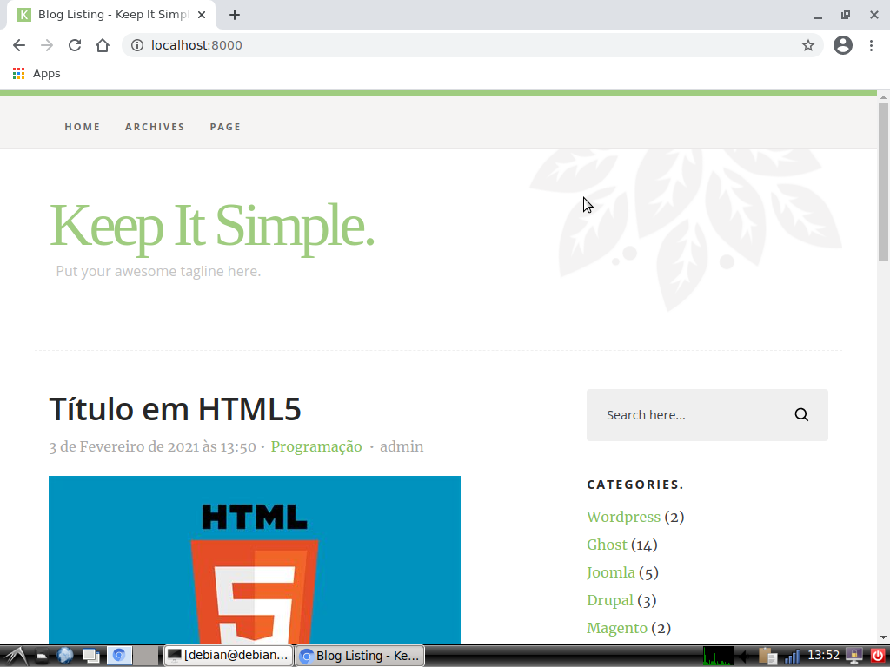

# Django-Blog
## Screenshot



## Installation Guide

First, clone:
```git clone https://github.com/Erick772/Django-Blog```

Create a virtual environment:
```python -m venv env```

Activate the virtual environment:
```source env/bin/activate```

Migrate:
```python manage.py migrate```

Create superuser:
```python manage.py createsuperuser```

Run the server:
```python manage.py runserver```
